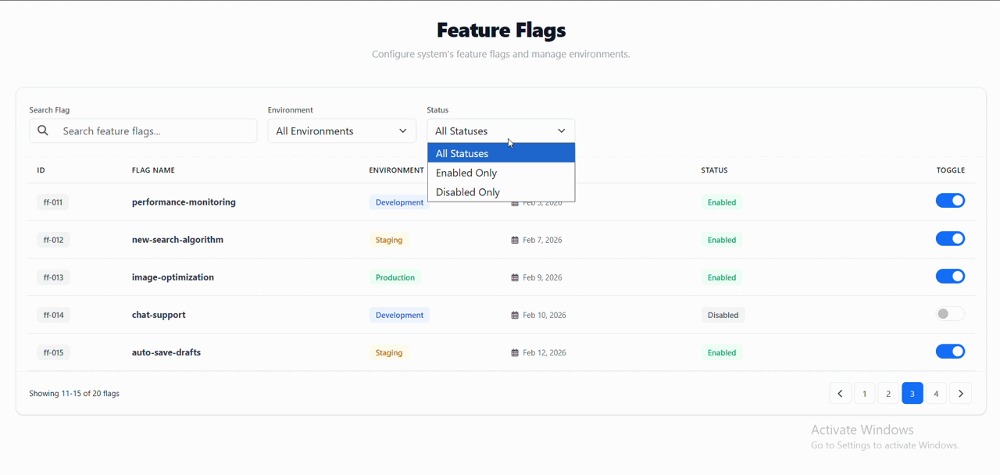

# Feature Flags Configuration Dashboard (Angular 17+)

A **Feature Flags Management Dashboard** built with modern Angular practices, simulating how enterprise applications manage runtime configuration across multiple environments (development / staging / production).

**Demonstrates:** feature flag filtering, environment-based configuration, server-side pagination, optimistic UI updates, global HTTP loading interception, centralized error handling, and mock REST API behaviour via `json-server`.

---

## Tech Stack

| Technology | Purpose |
|---|---|
| Angular 17+ Standalone | No NgModules – simplified structure |
| Angular Signals | ViewModel-driven UI state management |
| HttpClient Interceptors | Global loader simulation |
| Bootstrap | Lightweight styling |
| json-server | Mock REST API |
| zone.js | Simpler change detection setup |

---

## Architectural Decisions

### Standalone Components
Uses Angular Standalone Components instead of NgModules to reduce boilerplate, improve encapsulation, and align with Angular's future direction.

### Container / Presentational Pattern

The Feature Flags page follows a Smart Container / Dumb Component architecture.

The container component manages:

- API orchestration
- state mutation
- optimistic updates
- page change orchestration

Presentational components (Filters + Table) are responsible for UI rendering only.

### ViewModel (vm) Pattern

A computed ViewModel (`vm`) signal exposes UI-ready state to the template:

```ts
readonly vm = computed(() => ({
  flags: this.flags(),
  totalItems: this.totalCount(),
  page: this.pageNumber(),
  pageSize: this.pageSize(),
  searchTerm: this.searchTerm(),
  environment: this.selectedEnvironment(),
  status: this.selectedStatus(),
  environments: this.environments
}));

```

This keeps the template declarative while avoiding direct coupling to internal state signals.
---


### Optimistic UI Updates
Flags toggle instantly in the UI. If the API call fails (simulated 25% failure rate), the state rolls back and an error is shown globally.

```ts
this.flags.update(flags =>
  flags.map(f => f.id === flag.id ? { ...f, status: previousStatus } : f)
);
```

### Global HTTP Interceptor
A single `HttpClientInterceptor` handles loading state across all API calls — no per-component loading flags needed.

---

## Project Structure

```
src/app
│
├── components/
│   └── feature-flags/
│       ├── feature-flags-container.component.ts
│       ├── feature-flag-filters/
│       └── feature-flag-table/
│
├── core/
│   ├── interceptors/
│   └── state/
│       ├── loading.service.ts
│       └── error-handler.service.ts
│
├── models/
│   ├── feature-flag.model.ts
│   └── feature-flag.dto.ts
│
├── services/
│   └── feature-flags.service.ts
│
├── shared/
│   └── ui/
│       └── error-message/

```

---

## Getting Started

```bash
# Clone & install
git clone https://github.com/MarinoWilliam/feature-flags.git && cd feature-flags
npm install

# Run mock backend + app
npm start
```

App runs at `http://localhost:4200` — API at `http://localhost:3000/feature-flags`.

---

## App Demo

